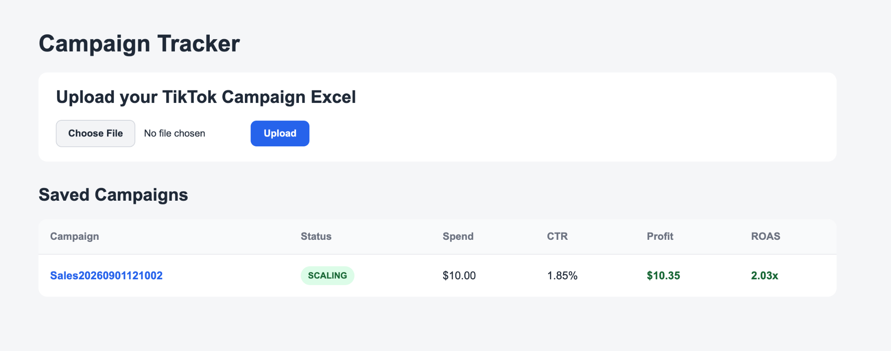
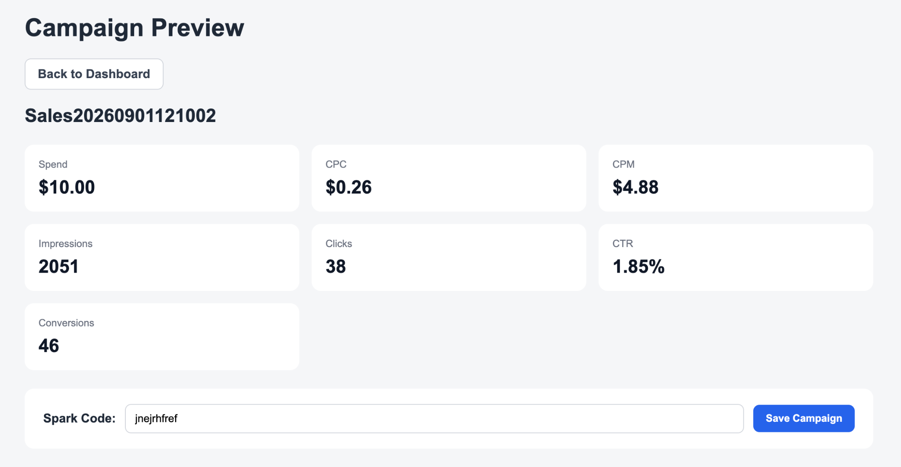
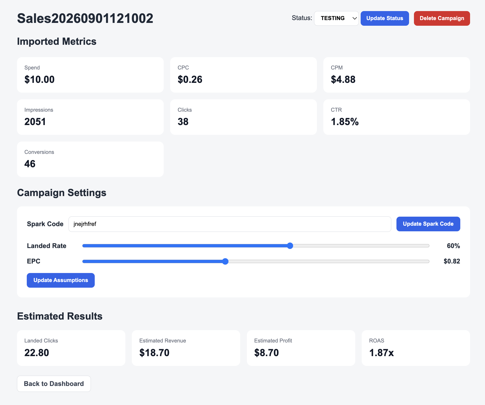

# Campaign Tracker

A Java Spring Boot application for tracking TikTok affiliate marketing campaigns and estimating campaign profitability.

## Why I Built It

TikTok campaign exports contain a lot of data, but I only need a few key metrics to evaluate campaign performance. I built this application to import those metrics, store campaigns, track campaign status, and estimate revenue, profit, and ROAS using my own affiliate assumptions.

## Features

- Import TikTok campaign data from `.xlsx` files
- Extract:
  - Spend
  - CPC
  - CPM
  - Impressions
  - Clicks
  - CTR
  - Conversions
- Save campaigns to PostgreSQL
- Add and update Spark codes
- Track campaign status:
  - Testing
  - Scaling
  - Killed
- Set landed-rate and EPC assumptions
- Calculate:
  - Landed clicks
  - Estimated revenue
  - Estimated profit
  - ROAS
- Prevent duplicate campaign imports
- Delete campaigns
- Handle invalid uploads and missing campaigns

## Tech Stack

- Java
- Spring Boot
- Spring MVC
- Spring Data JPA
- PostgreSQL
- Thymeleaf
- Apache POI
- HTML
- CSS
- JavaScript
- Maven

## How It Works

1. Upload a TikTok campaign Excel export.
2. The application reads only the required metrics.
3. Review the imported campaign data.
4. Enter the campaign Spark code.
5. Save the campaign to PostgreSQL.
6. Update campaign assumptions and status.
7. View estimated revenue, profit, and ROAS.

## Calculations

Landed Clicks:

```text
Clicks × Landed Rate
```

Estimated Revenue:

```text
Landed Clicks × EPC
```

Estimated Profit:

```text
Estimated Revenue - Spend
```

ROAS:

```text
Estimated Revenue / Spend
```

## Screenshots
### Dashboard

Upload TikTok campaign exports and view saved campaign performance.



### Campaign Import Preview

Review the metrics extracted from the TikTok Excel export before saving the campaign.



### Campaign Details

Manage campaign status, Spark code, landed-rate and EPC assumptions, and view estimated profitability.



## Running Locally

Requirements:

- Java 21+
- PostgreSQL
- Maven

Create a PostgreSQL database named:

```text
campaigntracker
```

Update `application.properties` with your local PostgreSQL username and password if needed.

Run the application:

```bash
./mvnw spring-boot:run
```

Then open:

```text
http://localhost:8080
```
